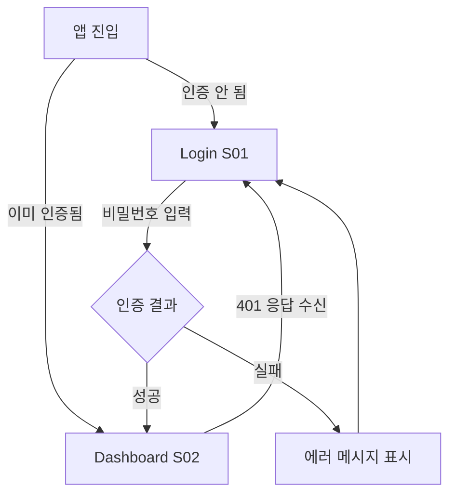
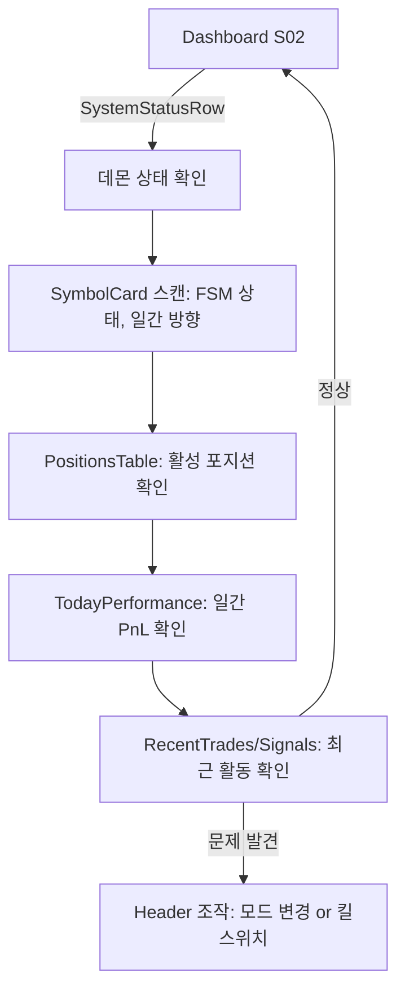
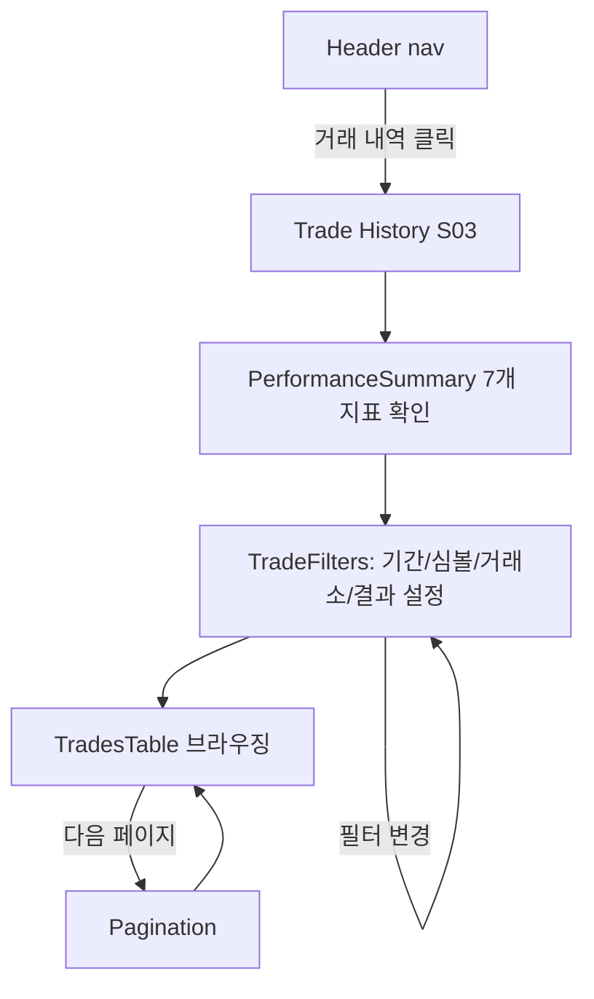
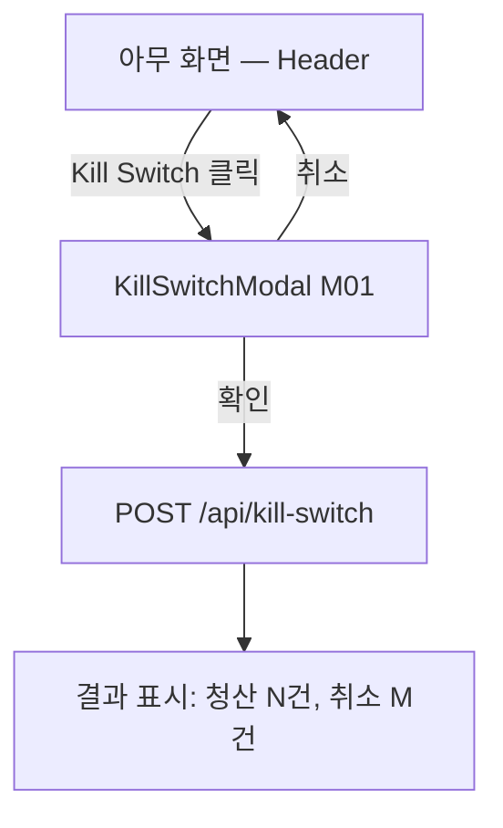
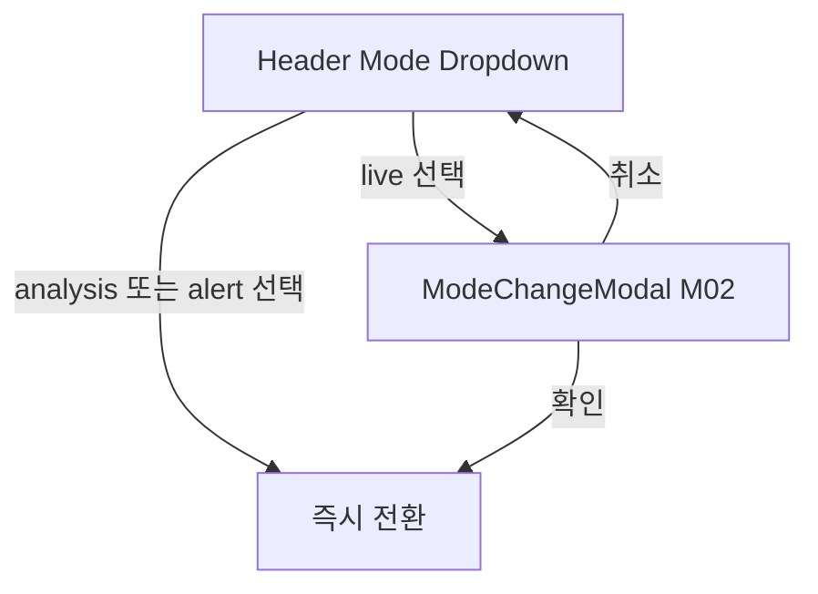

# Information Architecture

## Overview

combine-trade의 웹 UI는 단일 운영자가 자동매매 데몬을 모니터링하고 긴급 조작을 수행하기 위한 **3개 화면 + 2개 모달**로 구성된다. 플랫폼은 반응형 Web SPA (React + Vite)이며, 다크 모드 트레이딩 터미널 미학을 따른다. 주 알림 채널은 Slack이고, 웹 대시보드는 보조 모니터링 도구이다.

## User Roles & Key Tasks

| Role | Key Tasks | Access Scope |
|------|----------|-------------|
| 운영자 (단일) | 실시간 포지션/신호 모니터링, 거래 내역 분석, 실행 모드 변경, 수동 트레이드 블록, 긴급 킬스위치 | 전체 (단일 비밀번호 → JWT) |

## Sitemap

```
Auth Flow (unauthenticated)
└── S01 Login (/login)

Main App (authenticated — Layout wrapper)
├── Header [항상 표시]
│   ├── Logo → /
│   ├── Nav: 대시보드 (/) │ 거래 내역 (/trades)
│   ├── Mode Dropdown (analysis/alert/live)
│   ├── Trade Block Toggle (수동 차단)
│   └── Kill Switch Button (긴급 청산)
│
├── S02 Dashboard (/)
│   ├── Left Column (60%)
│   │   ├── SystemStatusRow (4-card grid: 데몬 상태)
│   │   ├── SymbolCard × N (심볼별 FSM, 일간 방향, 손실 카운터)
│   │   └── PositionsTable (활성 포지션)
│   └── Right Column (40%)
│       ├── TodayPerformance (일간 PnL)
│       ├── RecentTrades (최근 완결 거래)
│       ├── RecentSignals (최근 신호)
│       └── TransferHistory (이체 내역)
│
├── S03 Trade History (/trades)
│   ├── PerformanceSummary (7개 지표 카드)
│   ├── TradeFilters (기간/심볼/거래소/결과)
│   ├── TradesTable (페이지네이션, 20건/페이지)
│   └── Pagination
│
└── [S04 404 Not Found — 미구현, 추가 권장]
```

## Screen Inventory

| ID | Screen | Purpose | Nav Level | Route | Status |
|----|--------|---------|-----------|-------|--------|
| S01 | Login | 단일 비밀번호 인증 | — (standalone) | `/login` | 구현됨 |
| S02 | Dashboard | 실시간 포지션/신호 모니터링 허브 | L0 | `/` | 구현됨 |
| S03 | Trade History | 과거 거래 분석 (필터 + 페이지네이션) | L0 | `/trades` | 구현됨 |
| S04 | 404 Not Found | 잘못된 경로 안내 | — | `*` | **미구현** |
| M01 | Kill Switch Modal | 긴급 전체 포지션 청산 확인 | L3 (modal) | — | 구현됨 |
| M02 | Mode Change Modal | live 모드 전환 확인 | L3 (modal) | — | 구현됨 |

### 의도적 제외 화면

| 화면 | 제외 사유 |
|------|----------|
| 백테스트/WFO 뷰어 | CLI 도구 (`bun run backtest`). 개발/분석 단계 간헐 실행. |
| 설정 관리 | 핵심 조작은 Header에 존재. CommonCode 튜닝은 `PUT /api/common-code/:group/:code` API 직접 호출. |
| KPI 모니터링 전용 화면 | Slack 알림이 주 채널. Dashboard TodayPerformance로 충분. |
| 신호 상세 화면 | RecentSignals 테이블로 충분. 심층 분석은 DB 직접 조회. |

## Navigation Architecture

### Pattern: Top Nav Bar

| 근거 | 설명 |
|------|------|
| 화면 수 | 2개 L0 화면 → 사이드바 불필요 |
| 운영 조작 | Mode/TradeBlock/KillSwitch는 항상 접근 가능해야 함 → Header에 상주 |
| 단일 사용자 | 역할 분리, 접근 권한 UI 불필요 |

### Navigation Levels

| Level | 위치 | 포함 항목 |
|-------|------|----------|
| L0 (Global) | Header nav links | 대시보드, 거래 내역 |
| L0 (Controls) | Header right side | Mode dropdown, Trade Block toggle, Kill Switch |
| L1 (Section) | Page body | Dashboard 2-column grid, Trades filter bar |
| L2 (Contextual) | Query params | TradesPage `?period=&symbol=&exchange=&result=&page=` |
| L3 (Action) | Modal overlay | KillSwitchModal, ModeChangeModal |

### Responsive Behavior

반응형 웹은 first-class로 지원됨 (네이티브 모바일은 non-goal):

| Breakpoint | Layout |
|-----------|--------|
| Mobile (< 1024px) | 단일 컬럼, SystemStatusRow 2×2 grid |
| Desktop (≥ 1024px) | 2-column (60/40), SystemStatusRow 1×4 grid |

## User Flows

### Flow 1: Authentication



- **세션 만료**: JWT 24시간 TTL. 만료 시 API 401 → 자동 로그아웃 → Login 리디렉트
- **수동 로그아웃**: UI 버튼 없음 (의도적). 단일 운영자이므로 탭 닫기 또는 쿠키 만료로 충분

### Flow 2: Real-time Monitoring (주요 사용 시나리오)



대시보드는 자동 폴링으로 데이터를 갱신한다 (수동 새로고침 불필요):

| 데이터 | 폴링 주기 |
|--------|----------|
| Health (SystemStatus) | 30초 |
| SymbolStates | 5초 |
| Positions | 5초 |
| Stats (TodayPerformance) | 5초 |
| Config (mode, trade blocks) | 10초 |

### Flow 3: Trade Analysis



- URL 쿼리 파라미터로 필터 상태 유지: `?period=30d&symbol=BTCUSDT&page=2`
- 페이지네이션 이중 모델: URL은 `page` (사람 친화적), API는 `cursor` (성능)

### Flow 4: Emergency Kill Switch



킬스위치는 Slack 알림도 독립적으로 발송한다.

### Flow 5: Mode Change



**live 모드만 확인 모달 필요** — analysis/alert 전환은 위험도가 낮으므로 즉시 반영.

### Flow 6: Trade Block Management

```
Header Trade Block Toggle → 즉시 활성화/비활성화 → Header 상태 반영
```

수동 트레이드 블록은 POST/DELETE `/api/trade-blocks`를 통해 관리.

## URL/Route Design

| Route | Screen | Parameters | Auth |
|-------|--------|-----------|------|
| `/login` | Login (S01) | — | No |
| `/` | Dashboard (S02) | — | Yes |
| `/trades` | Trade History (S03) | `?period=&symbol=&exchange=&result=&page=` | Yes |
| `*` | 404 Not Found (S04) | — | — |

- SPA 폴백: 모든 non-`/api/` 경로 → `index.html` (React Router 클라이언트 라우팅)
- API 공개 경로: `/api/health`, `/api/login`, `/api/logout`

## Content Hierarchy

### Login (S01)

1. **[Hero]** 브랜드 — "COMBINE TRADE" + "Double-BB 자동매매 시스템"
2. **[Primary]** 비밀번호 입력 + 로그인 버튼
3. **[Secondary]** 에러 메시지 (조건부)
4. **[Tertiary]** 버전 배지 (v0.1.0)

### Dashboard (S02)

1. **[Hero]** SystemStatusRow — 데몬 health, 연결 상태, 실행 모드 (Left column 내 4-card grid)
2. **[Primary]** SymbolCards — 심볼별 FSM 상태, 일간 방향, 세션 박스, 손실 카운터 (Left 60%)
3. **[Primary]** PositionsTable — 활성 포지션: 진입가, SL, 사이즈, PnL (Left 60%)
4. **[Secondary]** TodayPerformance — 일간 PnL 요약 (Right 40%)
5. **[Secondary]** RecentTrades — 최근 완결 거래 N건 (Right 40%)
6. **[Secondary]** RecentSignals — 최근 신호 이벤트 (Right 40%)
7. **[Tertiary]** TransferHistory — 선물→현물 이체 로그 (Right 40%)

### Trade History (S03)

1. **[Hero]** PerformanceSummary — 7개 지표 카드 (totalPnl, totalTrades, winRate, avgRiskReward, maxDrawdown, expectancy, maxConsecutiveLosses)
2. **[Primary]** TradesTable — 페이지네이션된 종료 거래 목록 (방향, 결과, PnL, 보유시간)
3. **[Secondary]** TradeFilters — 기간, 심볼, 거래소, 결과 필터
4. **[Tertiary]** Pagination — 페이지 네비게이션 (20건/페이지)

## State Treatments

모든 데이터 의존 컴포넌트는 3가지 상태를 처리한다:

| 상태 | 처리 방식 |
|------|----------|
| **Loading** | 스켈레톤 애니메이션 (SystemStatusRow, PerformanceSummary, SymbolCard 각각 전용 스켈레톤 보유) |
| **Empty** | 안내 메시지 (예: "등록된 심볼 없음") |
| **Error** | TanStack Query `retry: 1` 후 stale 데이터 유지. 글로벌 에러 바운더리 미구현 — Slack이 주 알림 채널이므로 현재 수준 유지. |

## IA Decisions

| 결정 | 근거 |
|------|------|
| 3개 화면으로 제한 | PRODUCT.md 명시. 단일 운영자에게 화면 수보다 정보 밀도가 중요. |
| Top nav bar 패턴 | L0 화면 2개 + 상시 접근 필요 제어 3개. 사이드바는 과설계. |
| 로그아웃 버튼 없음 | 단일 운영자. JWT 24h TTL 만료 + 401 자동 리디렉트로 충분. |
| 설정 화면 없음 | 핵심 조작은 Header 내장. 튜너블 파라미터는 API 직접 호출 (운영자는 개발자). |
| 백테스트 뷰어 없음 | CLI 도구. 간헐적 실행, 웹 필요성 없음. |
| live 모드만 확인 모달 | analysis/alert는 저위험. live만 실 주문 발생 → 확인 필수. |
| 반응형 웹 지원 | 네이티브 앱 non-goal이지만, 모바일 브라우저로 확인 가능해야 함. |

## Known Gaps

| Gap | 심각도 | 권장 조치 |
|-----|--------|----------|
| 404 Not Found 화면 없음 | Medium | catch-all 라우트 + 간단한 안내 페이지 추가 |
| 글로벌 에러 바운더리 없음 | Low | API 미응답 시 배너 표시 고려 (현재: stale 데이터 유지) |

## Consensus Log

- Round 1: IA Architect drafted information architecture (기존 코드베이스 분석 기반, 인터뷰 1회)
- Round 2: Structure Reviewer REVISED — 8건 (404 화면, logout, 상태 처리, 폴링 주기, 페이지네이션 모델, config 편집 범위 문서화)
- Round 2: Critic APPROVED — 5건 관찰 (구조 적절, 문서 정확도 개선 반영)
- Round 3: 모든 피드백 반영하여 최종본 작성
- Verdict: consensus reached after 1 revision round
