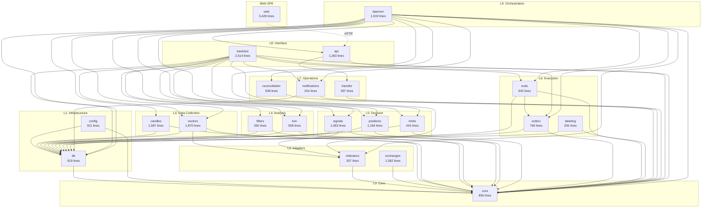

# Module Map

> Auto-generated: 2026-04-05 | Derived from actual import analysis

## Dependency Graph (Mermaid)



## Cross-Module Import Matrix

Actual imports observed in code. Rows = importer, Columns = imported module.

| Importer → | core | db | config | indicators | exchanges | candles | vectors | filters | knn | signals | positions | limits | orders | exits | labeling | reconciliation | notifications | transfer | api |
|---|---|---|---|---|---|---|---|---|---|---|---|---|---|---|---|---|---|---|---|
| **db** | R | — | — | — | — | — | — | — | — | — | — | — | — | — | — | — | — | — | — |
| **config** | R | R | — | — | — | — | — | — | — | — | — | — | — | — | — | — | — | — | — |
| **indicators** | R | — | — | — | — | — | — | — | — | — | — | — | — | — | — | — | — | — | — |
| **exchanges** | R | — | — | — | — | — | — | — | — | — | — | — | — | — | — | — | — | — | — |
| **candles** | R | R | — | — | — | — | — | — | — | — | — | — | — | — | — | — | — | — | — |
| **vectors** | R | R | — | R | — | — | — | — | — | — | — | — | — | — | — | — | — | — | — |
| **filters** | R | R | — | — | — | — | — | — | — | — | — | — | — | — | — | — | — | — | — |
| **knn** | R | R | — | — | — | — | — | — | — | — | — | — | — | — | — | — | — | — | — |
| **signals** | R | R | — | R | — | — | — | — | — | — | — | — | — | — | — | — | — | — | — |
| **positions** | R | R | — | — | — | — | — | — | — | — | — | — | — | — | — | — | — | — | — |
| **limits** | R | R | — | — | — | — | — | — | — | — | — | — | — | — | — | — | — | — | — |
| **orders** | R | R | — | — | — | — | — | — | — | — | — | — | — | — | — | — | — | — | — |
| **exits** | R | R | — | — | — | — | — | — | — | — | — | — | R | — | — | — | — | — | — |
| **labeling** | R | R | — | — | — | — | — | — | — | — | — | — | — | — | — | — | — | — | — |
| **reconciliation** | R | — | — | — | — | — | — | — | — | — | — | — | — | — | — | — | — | — | — |
| **notifications** | R | R | — | — | — | — | — | — | — | — | — | — | — | — | — | — | — | — | — |
| **transfer** | R | — | — | — | — | — | — | — | — | — | — | — | — | — | — | — | — | — | — |
| **api** | R | — | — | — | — | — | — | — | — | — | — | — | — | — | — | — | — | R | — |
| **backtest** | R | R | — | R | — | — | R | R | R | R | R | R | R | R | — | — | R | — | — |
| **daemon** | R | R | — | R | — | R | R | — | R | R | R | R | R | R | — | R | R | — | R |

> `R` = imports from that module. `—` = no import.

## Pipeline Data Flow

```
                    ┌──────────────────── 24/7 Daemon Loop ────────────────────┐
                    │                                                           │
  WebSocket ──→ [candles] ──→ [indicators] ──→ [filters] ──→ [signals]         │
                                                    │            │              │
                                                    │      WATCHING/Evidence    │
                                                    │            │              │
                                              [vectors] ──→ [knn] ──→ Decision │
                                                                 │              │
                                                          [positions] → [orders]│
                                                                 │              │
                                                            [exits] ← 60s tick │
                                                                 │              │
                                                          [labeling]            │
                    │                                                           │
                    │  [reconciliation] ← 60s interval (exchange ↔ DB sync)     │
                    │  [notifications]  ← fire-and-forget Slack alerts          │
                    │  [transfer]       ← scheduled futures→spot transfer       │
                    └───────────────────────────────────────────────────────────┘

  [api] ← HTTP → [web]     (read-only dashboard + control endpoints)
  [backtest]                (offline, reuses full pipeline via DI)
```

## Module Responsibility Map

| Module | Primary Responsibility | Key Invariant |
|--------|----------------------|---------------|
| **core** | Type definitions, Decimal wrappers, port interfaces | Zero dependencies; all financial math via Decimal.js |
| **db** | PostgreSQL connection, schema, migrations | Single pool; all tables defined in schema.ts |
| **config** | CommonCode-based configuration | Anchor groups immutable; Zod validation on every write |
| **indicators** | Technical indicator calculations | Pure math; uses @ixjb94/indicators for performance |
| **exchanges** | CCXT-based exchange adapters | Implements ExchangeAdapter port; per-exchange rate limiting |
| **candles** | WebSocket collection, REST history, gap recovery | Append-only; per exchange×symbol×timeframe |
| **vectors** | 202-dim feature vectorization | Median/IQR normalization; VECTOR_DIM=202 constant |
| **filters** | Direction filter, trade block scheduling | Fail-closed on external data failure |
| **knn** | pgvector HNSW search with time decay | Never returns stale neighbors; time decay mandatory |
| **signals** | WATCHING lifecycle, evidence/safety gates | WatchSession lifecycle: open→active→invalidated |
| **positions** | Ticket FSM, sizing, pyramiding | State transitions validated; max leverage=38× |
| **limits** | Per-symbol loss limiting (daily/session/hourly) | Independent of positions module (schema-direct) |
| **orders** | Order execution, slippage monitoring | SL registered before any post-entry action |
| **exits** | 3-stage exit (TP1→TP2→trailing), MFE/MAE | Exit checker is pure; manager handles exchange calls |
| **labeling** | Trade result & vector grade classification | Result: BIG_WIN/WIN/LOSS/BIG_LOSS; Grade: A/B/C/D/F |
| **reconciliation** | 60s DB↔exchange position sync | Never disabled in production; panic close on mismatch |
| **notifications** | Slack webhook alerts | Fire-and-forget; non-blocking; webhook URL from CommonCode |
| **transfer** | Scheduled futures→spot fund transfer | Balance calculation uses Decimal.js; reserveRatio enforced |
| **api** | REST endpoints (Hono) | DI-based; route deps injected; JWT auth |
| **backtest** | Offline backtesting, WFO, parameter search | Identical pipeline code; MockExchangeAdapter enforces temporal ordering |
| **daemon** | Main entry, pipeline orchestration, lifecycle | Orchestrates all layers; crash recovery on startup |
| **web** | React SPA dashboard | Zustand stores; TanStack Query for data fetching |

## External Dependencies

| Package | Used By | Purpose |
|---------|---------|---------|
| `decimal.js` | core, orders, exits, signals, limits, backtest | Arbitrary-precision decimal arithmetic |
| `drizzle-orm` | db, config, filters, knn, signals, positions, limits, orders, labeling, notifications, daemon | Type-safe SQL query builder + ORM |
| `postgres` | db | PostgreSQL driver |
| `ccxt` | exchanges/base | Unified crypto exchange API |
| `@ixjb94/indicators` | indicators | High-performance TA calculations |
| `fflate` | candles/history-loader | Gzip decompression for Binance CSV |
| `zod` | config/schema | Runtime type validation |
| `hono` | api | Lightweight web framework |
| `react` | web | UI framework |
| `react-router` | web | Client-side routing |
| `@tanstack/react-query` | web | Server state management |
| `zustand` | web | Client state management |

## File Count by Module

```
core/          6 files     856 lines
db/            6 files     919 lines
config/        4 files     911 lines
indicators/    7 files     357 lines
exchanges/     8 files   1,582 lines
candles/       9 files   1,587 lines
vectors/       5 files   1,870 lines
filters/       3 files     350 lines
knn/           4 files     558 lines
signals/       4 files   1,083 lines
positions/     5 files   1,184 lines
limits/        2 files     443 lines
orders/        3 files     766 lines
exits/         4 files     843 lines
labeling/      2 files     205 lines
reconciliation/ 3 files    538 lines
notifications/ 2 files     254 lines
transfer/      4 files     397 lines
api/          14 files   1,283 lines
backtest/     10 files   2,514 lines
daemon/        4 files   1,919 lines
web/          22 files   3,429 lines
scripts/       5 files     939 lines
─────────────────────────────────
TOTAL        130 files  22,379 lines
```
