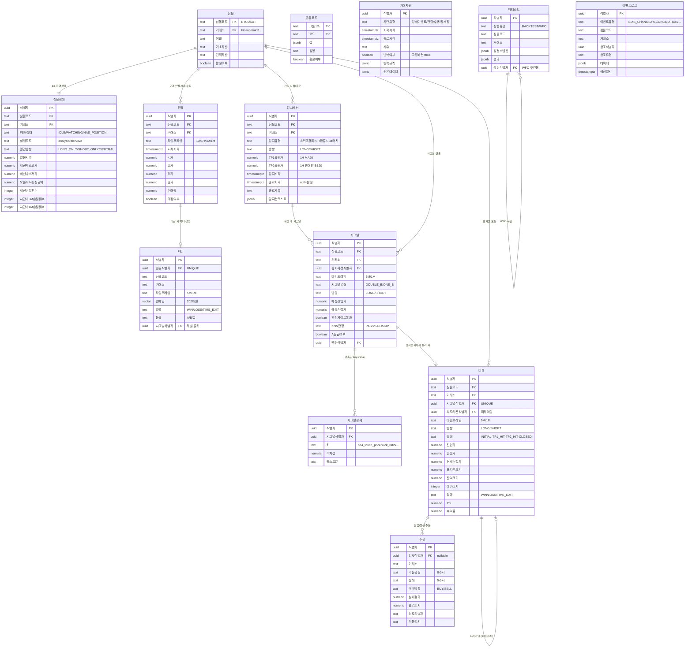

# combine-trade 논리 데이터 모델 (ERD)

> 2M + 1R + 10T = 13개 엔티티 | Double-BB + KNN 자동매매 시스템

## 전체 논리 모델



## 핵심 데이터 흐름

```
공통코드 (설정/파라미터)
    │
    ▼ 메모리 캐시 (ConfigStore)
    │
캔들(거래소별 수집) ──→ 감시세션(1H 마감 시 시작)
    │                        │
    ├──→ 벡터(5M/1M 마감시)  │
    │                        ▼
    └──→ 시그널(BB4 터치) ←── 감시세션이 선행
              │
              ├──→ 시그널상세(관측값 key-value)
              │
              ▼
         티켓(체결 시) ──→ 주문(거래소)
              │                │
              ▼                ▼
         벡터.label 확정   이벤트로그(모든 이력)
```

## 변경 이력

> 상세 변경 이력: [../changelogs/ERD_CHANGELOG.md](../changelogs/ERD_CHANGELOG.md)
